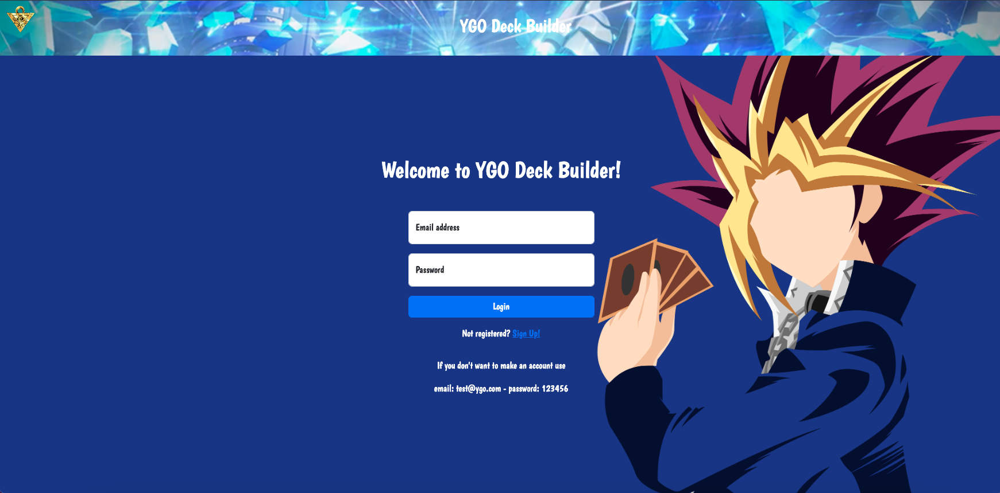

# ygodeck-creator

https://ygodeck-builder.herokuapp.com/

Search for cards, Create a Deck, and Share it.

## API

https://db.ygoprodeck.com/api-guide/

## Description

Create yu-gi-oh decks and share it in a shared deck space.

## Approach Taken

When building the website via server, I wanted to create a simple point and click interface for ease of use.

## Technologies used

- Sequelize
- Postgress
- EJS
- Axios
- Express.js
- Bcryptjs
- Node.js

## RESTful Routes

| VERB   | URL pattern       | Action \(CRUD\)   | Description                                                        |
| :----- | :---------------- | :---------------- | :----------------------------------------------------------------- |
| GET    | /                 | Index \(Read\)    | Homepage                                                           |
| POST   | /                 | Index \(Read\)    | Check user creds                                                   |
| GET    | /logout           | Logout \(Read\)   | Logs user out                                                      |
| GET    | /user             | Login \(Read\)    | Login from '/' redirect to '/profile'                              |
| POST   | /user/new         | New \(Create\)    | creates a new user, email,username,password redirect to '/profile' |
| GET    | /profile          | Show \(Read\)     | profile dashboard, shows decks                                     |
| PUT    | /profile/edit     | Edit \(Read\)     | Edit profile details                                               |
| POST   | /deck             | New \(Create\)    | create a new deck                                                  |
| GET    | /deck/:id/results | Show \(Read\)     | show page with deck with search function                           |
| DELETE | /deck/:id/delete  | Delete \(Delete\) | delete deck redirect to '/profile'                                 |

### Goals

#### MVP

- Create boilerplate models, databases, and ejs layouts
- Create Homepage
- Create login page and logout
- Create new user
- Authenticate user using bcrypt, dotenv, and cryptojs
- Create a new deck
- update the deck
- delete the deck
- Search for cards and add it to a deck

#### Stretch Goals

- Create shared deck page
- Share a deck
- Add a new comment
- Update comment
- Delete comment
- add more fields for card search function

| VERB | URL pattern      | Action \(CRUD\) | Description                  |
| :--- | :--------------- | :-------------- | :--------------------------- |
| GET  | /shareddecks     | Show \(Read\)   | show all shared decks        |
| POST | /shareddecks     | New \(Create\)  | share an exsisting deck      |
| GET  | /shareddecks/:id | Show \(Read\)   | show page with specific deck |
